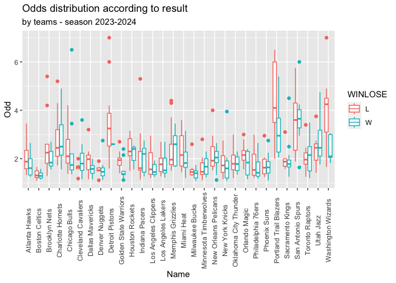

<!-- README.md is generated from README.Rmd. Please edit that file -->

# winaRaque

<!-- badges: start -->

[](https://github.com/Alexis-vs/winaRaque/actions/workflows/R-CMD-check.yaml)
[](https://github.com/Alexis-vs/winaRaque/actions/workflows/nba_matchs_scrap.yml)
<!-- badges: end -->

The goal of winaRaque is to explore sport data and make analysis with
sport betting odds. The first analyzes will be done through the NBA.

## Installation

You can install the development version of winaRaque from
[GitHub](https://github.com/) with:

``` r
# install.packages("devtools")
devtools::install_github("Alexis-vs/winaRaque")
```

## Example

You can get NBA results with 1/2 odds for a day.

``` r
library(winaRaque)

get_nba_scores("2023-10-30", pivot_results = TRUE)
#> # A tibble: 22 × 13
#>    day_match   matchId set       Name    Odd WINLOSE   PTS FG_PCT FG3_PCT FT_PCT
#>    <date>        <int> <chr>     <chr> <dbl> <chr>   <dbl>  <dbl>   <dbl>  <dbl>
#>  1 2023-10-30 43065447 Competit… Atla…  2    W         127  0.558   0.467  0.944
#>  2 2023-10-30 43065447 Competit… Minn…  1.76 L         113  0.489   0.485  0.6  
#>  3 2023-10-30 43065441 Competit… Char…  1.92 L         121  0.49    0.258  0.95 
#>  4 2023-10-30 43065441 Competit… Broo…  1.84 W         133  0.563   0.364  0.719
#>  5 2023-10-30 43065459 Competit… Denv…  1.25 W         110  0.56    0.321  0.412
#>  6 2023-10-30 43065459 Competit… Utah…  3.75 L         102  0.429   0.297  0.467
#>  7 2023-10-30 43065443 Competit… Indi…  1.62 L         105  0.409   0.261  0.84 
#>  8 2023-10-30 43065443 Competit… Chic…  2.2  W         112  0.46    0.353  0.839
#>  9 2023-10-30 43065461 Competit… Los …  1.74 W         106  0.532   0.296  0.778
#> 10 2023-10-30 43065461 Competit… Orla…  2.05 L         103  0.4     0.4    0.722
#> # ℹ 12 more rows
#> # ℹ 3 more variables: AST <dbl>, REB <dbl>, TOV <dbl>
```

## Small data visualization

``` r
# the workflow has been taking the odds since 2023-03-20
seq_date <- seq.Date(from = as.Date("2023-10-24"), # NBA opening 2023-2024
                     to = Sys.Date(),
                     by = "day")
list_results <- lapply(seq_date, get_nba_scores, pivot_results = TRUE)
results <- do.call("rbind", list_results)
```

``` r
library(ggplot2)
library(dplyr)

results %>%
  ggplot(aes(x = Name, y = Odd, color = WINLOSE)) +
  geom_boxplot() +
  theme(axis.text.x = element_text(angle = 90, vjust = 0.5)) +
  ggtitle("Odds distribution according to result", subtitle = "by teams - season 2023-2024")
```



## Data collect

A workflow run everyday to get all NBA odds for the night (currently
stopped because no NBA matchs). The results are in `inst/extdata`.  
An other workflow run every morning to collect odds for shiny app.

## Shiny

Shiny app to explore ‘surbet’ variations during games of 1/2 sports
(tennis, basketball, baseball). Run the Shiny app with `app.R`.
